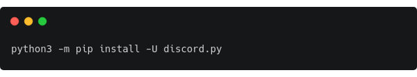
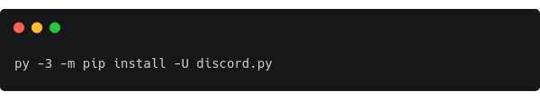
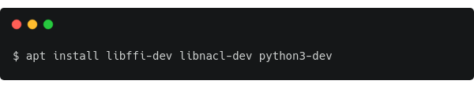

<p align="center"></p>
<h3 align="center">Hachi Bot</h3>
<p align="center">Bot Documentation</p>
<p align="center"><a href="#"></a>

## Table of  Contents
1. <a href='#1-overview'>Overview</a><br>
2. <a href='#2-license'>License</a>
3. <a href='#3-installation-of-required-components'>Installation of required components</a><br>
  3.1. <a href='#31-you-will-need'>You will need</a><br>
  3.2. <a href='#32-how-to-get-discord-library'>How to get discord</a><br>
  3.3. <a href='#33-choose-an-ide'>Choose an IDE</a>
4. <a href='#4-bot-events'>Bot events</a><br>
  4.1. <a href='#41-on_ready'>On_ready()</a><br>
  4.2. <a href='#42-on_message'>On_message()</a><br>
  4.3. <a href='#43-on_command_completion'>On_command_completion()</a>
5. <a href='#5-bot-commands'>Bot commands</a><br>
  5.1. <a href='#51-owner-commands'>Owner commands</a>
6. <a href='#6-help'>Help</a>

## 1. Overview
### What is Hachi bot?

Hachi bot is a fun free project for everyone and always will be. If you like this project, you can leave [here](https://github.com/blaze-github/Discord-Bot/issues/new?assignees=&labels=&template=project-ideas.md&title=) an idea that will possibly be realized in the next update, but if you found any mistake in my code or you can make it better you can contact me in [Discord](https://discord.gg/zsFS4v5zvf) or leave a request [here](https://github.com/blaze-github/Discord-Bot/issues/new?assignees=&labels=&template=mistakes-or-errors.md&title=).

### Why Hachi?

```I will add description shortly```

<!--

[](https://www.codacy.com/gh/blaze-github/Discord-Bot/dashboard?utm_source=github.com&amp;utm_medium=referral&amp;utm_content=blaze-github/Discord-Bot&amp;utm_campaign=Badge_Grade) 
[](https://top.gg/bot/766415375856304150) 


-->
## 2. License
This project use **BSD-3-Clause License**.  

| Permissions                         | Limitations         | Conditions                                       |
| ----------------------------------- | ------------------- | ------------------------------------------------ |
| :white_check_mark:  Commercial use  | :x:  Liability      | :information_source: License and copyright notice|
| :white_check_mark:  Modification    | :x:  Warranty       |                                                  |
| :white_check_mark:  Distribution    |                     |                                                  |
| :white_check_mark:  Distribution    |                     |                                                  |

<a href='LICENSE'></a>

## 3. Installation of required components

### 3.1. You will need
- `Python 3.8.0` or greater. <a href='https://www.python.org/downloads/'></a><br>

- `discord.py 1.3.0` or greater. <a href='#32-how-to-get-discord-library'></a><br>

- `IDE (Integrated development environment)` <a href='#33-choose-an-ide'></a>


### 3.2. How to get **discord** library
You can get the library directly from PyPI:

[//]: <> ()
```
python3 -m pip install -U discord.py
```
If you are using Windows, then the following should be used instead:

[//]: <> ()
```
py -3 -m pip install -U discord.py
```
For a Debian-based system, the following command will get these dependencies:

[//]: <> ()
````
$ apt install libffi-dev libnacl-dev python3-dev
````
### 3.3. Choose an IDE
 <a href='https://atom.io/'></a>
<br>

<a href='https://www.sublimetext.com/3'> </a>
<br>

<a href='https://code.visualstudio.com/Download'> </a>
<br>

<a href='https://www.jetbrains.com/pycharm/download/'> </a>
<br>

<a href='https://jupyter.org/install'> </a>
<br>

<a href='https://www.spyder-ide.org/#section-download'> </a>

## 4. Bot events

### 4.1. On_ready()
<b>1.</b> Print in console bot name and bot id.
```python
print('---------------------')
print('Logged in as')
print(self.bot.user.name)
print(self.bot.user.id)
print('---------------------')
```
<b>2.</b> Set bot activity.
```python    
activity = discord.Activity(type = discord.ActivityType.watching, name = '?help')
await self.bot.change_presence(status=discord.Status.online, activity=activity)

```
### 4.2. On_message()
Check if user is bot.
```python
if message.author == self.bot.user:
            return
```
### 4.3. On_command_completion()
Print message in console when the command is successful invoked
```python
print('</> Command "{}" was invoked successfully by {}.'.format(ctx.command.name, ctx.message.author))
```

## 5. Bot commands

### 5.1. Owner commands
```
Empty
```
## 6. Help
For help and enquiries:

<a target="_blank" rel="noopener noreferrer" href="https://discord.gg/AkKsMRx23Q"></a>
