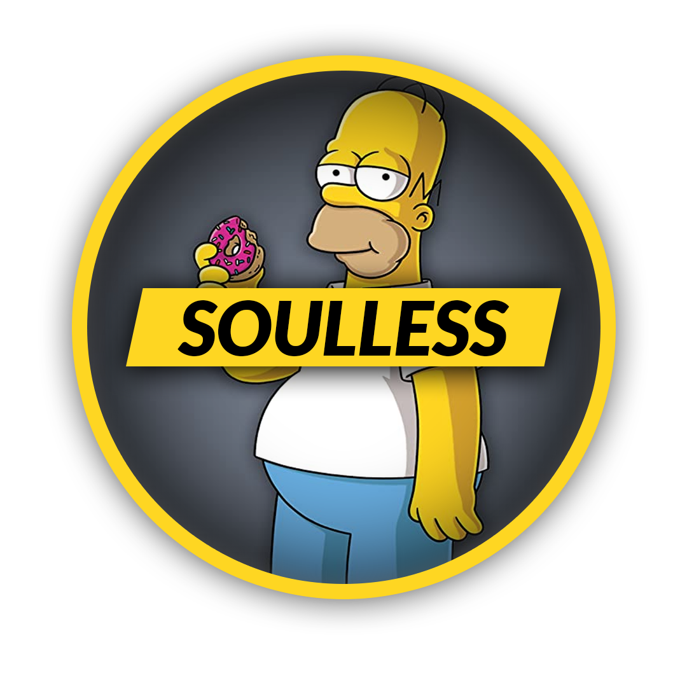

<p align="center"></p>
<h1 align="center" >Soulless Bot</h1>
<p align="center">Bot Documentation</p>

## Table of  Contents
1. <a href='#1-overview'>Overview</a><br>
2. <a href='#2-license'>License</a>
3. <a href='#3-installation-of-required-components'>Installation of required components</a><br>
  3.1. <a href='#31-you-will-need'>You will need</a><br>
  3.2. <a href='#32-how-to-get-discord-library'>How to get discord</a><br>
  3.3. <a href='#33-choose-an-ide'>Choose an IDE</a>
4. <a href='#4-bot-commands'>Bot commands</a><br>
  4.1. <a href='#41-command-name'>Command name</a>
5. <a href='#5-help'>Help</a>

## 1. Overview
This repository contains all the code for the bot. <br>


## 2. License
This project use **BSD-3-Clause License**.  

| Permissions                         | Limitations         | Conditions                                       |
| ----------------------------------- | ------------------- | ------------------------------------------------ |
| :white_check_mark:  Commercial use  | :x:  Liability      | :information_source: License and copyright notice|
| :white_check_mark:  Modification    | :x:  Warranty       |                                                  |
| :white_check_mark:  Distribution    |                     |                                                  |
| :white_check_mark:  Distribution    |                     |                                                  |

<a href='LICENSE'></a>

## 3. Installation of required components

### 3.1. You will need
- `Python 3.8.0` or greater. <a href='https://www.python.org/downloads/'></a><br>

- `discord.py 1.3.0` or greater. <a href='#32-how-to-get-discord-library'></a><br>

- `IDE` <a href='#33-choose-an-ide'></a>


### 3.2. How to get **discord** library
You can get the library directly from PyPI: <br>
```
python3 -m pip install -U discord.py
```

If you are using Windows, then the following should be used instead: <br>
```
py -3 -m pip install -U discord.py
```

For a Debian-based system, the following command will get these dependencies: <br>
```
$ apt install libffi-dev libnacl-dev python3-dev
```

### 3.3. Choose an IDE
 <a href='https://atom.io/'></a>
<br>

<a href='https://www.sublimetext.com/3'> </a>
<br>

<a href='https://code.visualstudio.com/Download'> </a>
<br>

<a href='https://www.jetbrains.com/pycharm/download/'> </a>
<br>

<a href='https://jupyter.org/install'> </a>


## 4. Bot commands

### 4.1. Command name
```
Empty
```
## 5. Help
For help and enquiries:
<br>

<a href='https://www.instagram.com/sfratescu00/'> </a>

<a href='https://discord.com/users/385834838793388033'> </a>
